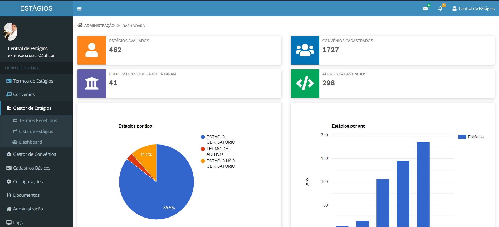

# SISTEMA DE ESTÁGIOS - UFC CAMPUS RUSSAS - CE

<!---Esses são exemplos. Veja https://shields.io para outras pessoas ou para personalizar este conjunto de escudos. Você pode querer incluir dependências, status do projeto e informações de licença aqui--->

##ÁREA ADMINISTRATIVA

##ÁREA ALUNO

##DASHBOARD

> o SISTEMA DE ESTÁGIOS gerencia e registra todos os processos de estágios do Campus Russas - UFC.

### Ajustes e melhorias

O projeto ainda está em desenvolvimento e as próximas atualizações serão voltadas nas seguintes tarefas:

- [x] Área do Aluno
- [x] Área administrativa
- [x] Convênios
- [x] notificações
- [x] configuração e instalação aws amazon
- [x] otimização de dados e banco de dados
- [x] Dashboard
- [ ] Envio de e-mails e templates
- [ ] Relatórios
- [ ] Automação de notificações
- [ ] Sistema automático de avaliações de estágios 
- [ ] Implementar validações automaticas baseadas legislação  de estágio

## 😄 Seja um dos contribuidores 

Quer fazer parte desse projeto? Clique [AQUI](CONTRIBUTING.md) e leia como contribuir.

## 📝 Licença

Esse projeto está sob licença. Veja o arquivo [LICENÇA](LICENSE.md) para mais detalhes.

[⬆ Voltar ao topo](#nome-do-projeto) 
